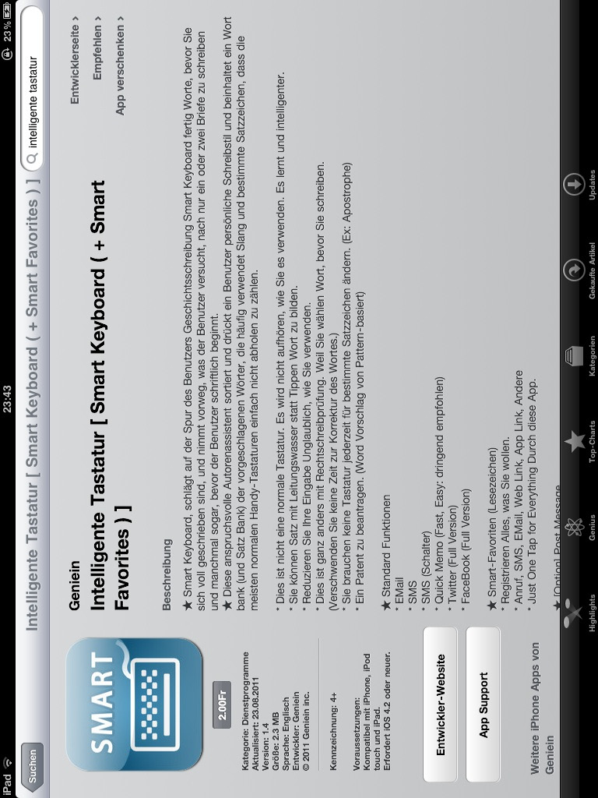

# App-Werbung

**Fach:** Deutsch
**Stufe:** Sek 1
**Zeitbedarf:** ca. 45-60 Minuten

## Ausgangssituation

Smarte Tastatur - smarte Werbung? App-Entwickler kennen kaum Grenzen, wenn es darum geht, die Benutzerfreundlichkeit der modernen Smartphone noch zu steigern. Dass beim Übersetzen manchmal die Leserfreundlichkeit etwas leidet, scheint nebensächlich zu sein, wie ein Beispiel aus Korea zeigt.

### Der Werbetext

> Smart Keyboard, schlägt auf der Spur des Benutzers Geschichtsschreibung Smart Keyboard fertig Worte, bevor Sie sich voll geschrieben sind, und nimmt vorweg, was der Benutzer versucht, nach nur ein oder zwei Briefe zu schreiben und manchmal sogar, bevor der Benutzer schriftlich beginnt.
>
> Dieser anspruchsvolle Autorenassistent sortiert und drückt ein Benutzer persönliche Schreibstil und beinhaltet ein Wort Bank (und Satz Bank) der vorgeschlagene Wörter, die häufig verwendet Slang und bestimmte Satzzeichen, dass die meisten normalen Handy-Tastaturen einfach nicht abholen zu zählen.
>
> Dies ist nicht eine normale Tastatur. Es wird nicht aufhören, wie Sie es verwenden. Es lernt und intelligenter. Sie können Satz mit Leitungswasser statt Tippen Wort zu bilden. Reduzieren Sie Ihre Eingabe Unglaublich, wie Sie verwenden.
>
> Dies ist ganz anders mit Rechtschreibprüfung. Weil Sie wählen Wort bevor Sie schreiben.
>
> Die Tastatur mag intelligent sein, ihre deutsche Werbung jedenfalls ist es nicht.

*Originaltext aus dem App-Store von Apple*

*Originalscreenshot der App-Store-Beschreibung*

## Aufgabenstellung

**Was wird hier eigentlich ausgesagt?**

Lies den Werbetext genau und versuche herauszufinden, was die App tatsächlich kann - trotz (oder gerade wegen) der holprigen Übersetzung.

**Mögliche Denkrichtungen:**
- Welche Wörter oder Sätze ergeben so, wie sie dastehen, keinen Sinn?
- Was könnte ursprünglich (auf Englisch) gemeint gewesen sein?
- Schreibe den Werbetext in verständlichem Deutsch um.
- Was sagt dieses Beispiel über maschinelle Übersetzung aus?

---

**Konzept & Gestaltung:** David Halser | denkwerk.schule
**Lizenz:** CC-BY-SA
