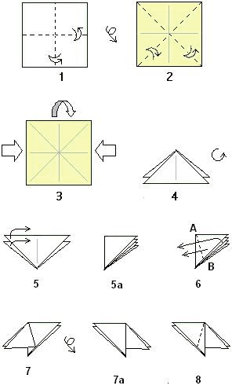
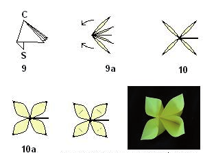

# Origami-Blume

**Fach:** Deutsch
**Stufe:** Sek 1
**Zeitbedarf:** ca. 45-60 Minuten

## Ausgangssituation

Die folgende Faltanleitung für eine Origami-Blume stammt aus einer englisch-sprachigen Webseite und wurde mit Google übersetzt. Überarbeite den Text so, dass daraus eine klar verständliche Anleitung wird.

### Faltanleitung (Originalübersetzung)

1. Wenn Sie Origami-Papier benutzen, das auf einer Seite weiss ist, beginnen Sie mit der weissen seitlichen Einfassung oben. Falten Sie das Papier von links nach rechts verlaufend, breiten Sie aus. Wiederholen Sie, indem Sie horizontal sich falten, breiten Sie aus. Dieses gibt ein „+" Knickmarkierung.
2. Wenden Sie das Papier um und falten Sie es auf dem diagonalen Ecke, um in Verlegenheit zu bringen; breiten Sie aus. Wiederholen Sie, indem Sie Ecke falten, um entlang der anderen Diagonale in Verlegenheit zu bringen; breiten Sie aus. Dieses gibt ein „X" Knickmarkierung.
3. Stürzen Sie das Papier in eine Waterbomb-Unterseite ein. Um dies zu tun, senken Sie die Oberseite des Papiers in Richtung zur Unterseite, indem Sie die Seiten einwärts drücken.
4. Dieses faltet sich natürlich in ein Dreieck mit zwei Klappen auf dem links und zwei Klappen auf dem Recht.
5. Drehen Sie das Modell, damit die Unterseite des Dreiecks hoch ist und die Spitze unten ist. Falten Sie die zwei Klappen auf dem links zur rechten Seite. Alle 4 Klappen sollten auf 5a wie gezeigt gestapelt werden.
6. Falten Sie zwei Schichten zurück zu der linken Seite, aber falten Sie sich schräg entlang Knick A bis B wie gezeigt.
7. Wie dieses ist, wie das Modell aussehen sollte. Anmerkung: falten Sie sich so genau wie möglich, A als scharfer Punkt zu halten. Wenden Sie das Modell wie in 7a gezeigt um.
8. Wiederholung auf den restlichen zwei Klappen: falten Sie sich entlang den ausgestrichenen Linien.
9. Die 4 Klappen überschneiden wieder, aber es gibt eine Spitze. Die Spitze (beschriftet „S") sei der Stamm der Blume. „C" sei die Mitte der Blume. Halten Sie die Spitze und drehen Sie das Modell, damit Sie C direkt betrachten. Trennen Sie die 4 Klappen gleichmässig wie in Schritt 10 gezeigt.
10. Benutzen Sie Ihre Finger und Hebel, um die Klappenschichten zu öffnen, also sehen sie wie 10a aus. Bei Bedarf verbiegen Sie das Blumenblatt zurück, das wenig ist, also hält es seine Form. Fertig!

## Material

## Aufgabenstellung

**Schreibe die Faltanleitung so um, dass sie klar, verständlich und in korrektem Deutsch ist - jemand, der noch nie Origami gefaltet hat, soll die Blume damit nachbauen können.**

**Mögliche Denkrichtungen:**
- Welche Sätze ergeben grammatikalisch oder inhaltlich keinen Sinn? Was war vermutlich im englischen Original gemeint?
- Welche Fachbegriffe (z.B. „Waterbomb-Basis") solltest du erklären oder durch verständlichere Wörter ersetzen?
- Falte die Blume selbst nach deiner überarbeiteten Anleitung nach - funktioniert sie?

---

**Konzept & Gestaltung:** David Halser | denkwerk.schule
**Lizenz:** CC-BY-SA
