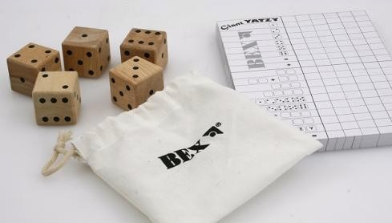

# Yatzi ohne Würfel

**Fach:** Deutsch
**Stufe:** Sek 1
**Zeitbedarf:** ca. 45-60 Minuten

## Ausgangssituation

Familie Campell macht einen Ausflug in den Zürcher Zoo. Da die SBB preiswerte Kombi-Tickets für Zug, Tram und Zoo-Eintritt verkaufen, beschliessen sie, das Auto für einmal in der Garage zu lassen und mit dem öffentlichen Verkehr zu reisen.

### Unterwegs

Mama Sophia packt für die Kinder etwas zum Spielen und Verpflegung ein. Nachdem sie bereits drei Mal bei UNO verloren hat, möchte die 10-jährige Laura nicht noch ein viertes Mal verlieren. Sie schlägt vor, Yatzi zu spielen, da sie sowieso lieber Buchstaben und Wörter hat als Zahlen und Rechnungen. Doch leider hat die Mutter Yatzi gar nicht mitgenommen, da sie gedacht hat, dass dieses Spiel mit den vielen Würfeln nicht geeignet für den Zug sei.

Doch Laura gibt nicht auf. „Ich habe eine Idee!" ruft sie nach einer Weile, „wie wir Yatzi spielen können, ohne dabei die Würfel zu verlieren." „So, und wie soll das bitte schön gehen?" neckt sie ihr älterer Bruder Fabian.

„Ist doch ganz einfach", sagt Laura. „Wir brauchen bloss eine Zeitung." Sie spaziert durch den Wagen und kommt kurz darauf mit einer Ausgabe der Südostschweiz zurück.

„Wir nehmen einfach eine Schlagzeile und bauen daraus so viele andere Wörter wie wir finden können. Jeder Buchstabe darf dabei nur ein Mal verwendet werden, und die Wörter, welche bereits in der Schlagzeile vorkommen, gelten nicht mehr." „Coole Idee!" findet nun auch ihr Bruder Fabian. Abgemacht - das Spiel kann beginnen!

Laura zeigt auf die erste Schlagzeile in der Zeitung:

1. Steinschlag auf der Berninalinie der RhB
2. Kleinflugzeug nach Sturm in den Anden vermisst
3. Preisfallen: Konsumentenschützer schlägt Alarm
4. Blutige Unruhen in Mali
5. Hochdruckgebiet bleibt uns auch am Wochenende erhalten

## Material

## Aufgabenstellung

**Wähle eine der fünf Schlagzeilen und finde so viele deutsche Wörter wie möglich, die sich ausschliesslich aus den Buchstaben dieser Schlagzeile bilden lassen - jeder Buchstabe darf dabei nur so oft verwendet werden, wie er in der Schlagzeile vorkommt. Wörter, die bereits Teil der Schlagzeile sind, zählen nicht.**

**Mögliche Denkrichtungen:**
- Wie gehst du systematisch vor, damit du möglichst viele Wörter findest und keine Buchstaben-Kombination übersiehst?
- Zählen auch zusammengesetzte Wörter oder nur einzelne Grundwörter?
- Spielt die Länge der gefundenen Wörter für die „Punktzahl" eine Rolle - wie könntet ihr eine Wertung wie bei echtem Yatzi festlegen?

---

**Konzept & Gestaltung:** David Halser | denkwerk.schule
**Lizenz:** CC-BY-SA
