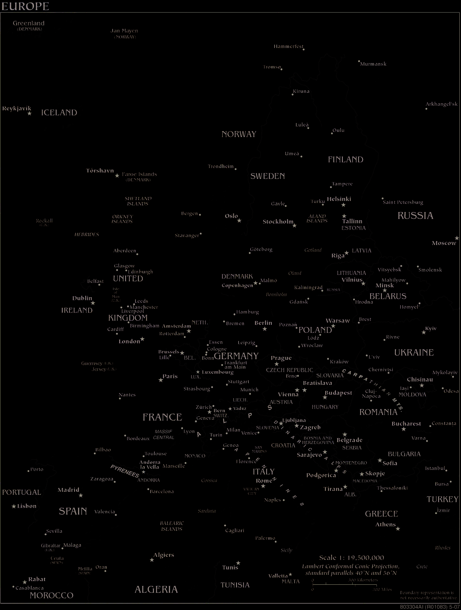

# Anruf aus Rovaniemi

**Fach:** Geografie
**Stufe:** Sek 1
**Zeitbedarf:** ca. 60-90 Minuten

## Ausgangssituation

**Ein Telefongespräch zwischen Laura in Rovaniemi (Finnland) und Catrina in Ilanz (Graubünden):**

> **Laura:** Caminada.
>
> **Catrina:** Tgau Catrina! Ich bins, Laura.
>
> **Laura:** Hey Laura, schön, dass du mich anrufst! Bist du gut gereist?
>
> **Catrina:** Ja, der Flug über Helsinki nach Rovaniemi war wunderschön. Und, wie ist deine Gastfamilie? Können die ein bisschen Deutsch?
>
> **Laura:** Nein, leider nicht. Oder vielleicht zum Glück nicht. Ich mache ja dieses Austauschjahr, um möglichst viel Finnisch zu lernen. Jedenfalls sind sie ganz nett und haben mir schon viel über ihre Region erzählt - bloss verstanden habe ich nicht alles.
>
> **Catrina:** Und, wie ist das Wetter bei euch im hohen Norden?
>
> **Laura:** Momentan haben wir einen fast wolkenlosen Himmel - und super lang Tag wegen der Mitternachtssonne. Ich sage dir, das ist so schön, selbst um 11 Uhr abends ist es noch taghell draussen.
>
> **Catrina:** Ja ja, das ist ja gut und recht, vergiss aber nicht, dass du ein ganzes Jahr in Finnland verbringen wirst und da wirst du auch noch lange dunkle Wintertage erleben. Da wirst du die Sonne bestimmt vermissen.
>
> **Laura:** Das ist schon möglich, ich bin ja selber gespannt, wie sich dann die Dunkelheit auf die Stimmung auswirken wird. Jedenfalls bekomme ich hier am Polarkreis über das ganze Jahr gesehen gleich viel Sonne ab wie du.
>
> **Catrina:** Ach so ein Quatsch, das sagst du jetzt nur, um dich über den langen Winter hinwegzutrösten.
>
> **Laura:** Nein, sicher nicht. Ich werde dir einen Beweis liefern, dass die Sonne in Rovaniemi pro Jahr gleich lang scheint wie in Ilanz. Wetten, dass du dich da irrst!
>
> **Catrina:** OK! Wette angenommen. Beide haben bis Übermorgen Zeit, einen Beweis für die eigene Behauptung zu liefern. Du sagst, dass die Sonne in Ilanz pro Jahr länger scheint als in Rovaniemi und ich behaupte, dass die Tagesdauer über ein ganzes Jahr summiert an beiden Orten, ja sogar überall auf der Welt gleich ist.
>
> **Laura:** Und was erhält die Siegerin?
>
> **Catrina:** Ruhm und Ehre und jede Menge gutes Gefühl.
>
> **Laura:** Alles klar, wir hören uns, tschüss Catrina.
>
> **Catrina:** Tschüss Laura.

## Material

*Quelle: eigene Bearbeitung*

*Mitternachtssonne in Rovaniemi. Quelle: http://koti.mbnet.fi/hiihoo/rovaniemi/*

## Aufgabenstellung

**Wer gewinnt die Wette - Laura oder Catrina? Begründe deine Antwort.**

**Mögliche Denkrichtungen:**
- Was bedeutet "Mitternachtssonne" und "Polarnacht"?
- Wie hängt die Tageslänge mit der geografischen Breite zusammen?
- Ist die Behauptung "über ein ganzes Jahr gesehen gleich viel Sonne" wirklich falsch, wie Catrina vermutet?

---

**Konzept & Gestaltung:** David Halser | denkwerk.schule
**Lizenz:** CC-BY-SA
