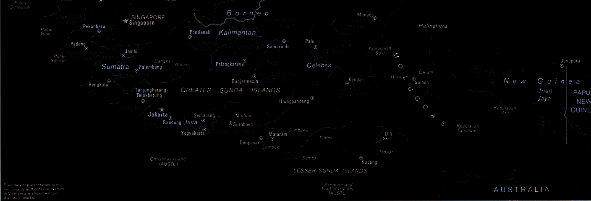

# Flucht durch die Inseln

**Fach:** Geografie
**Stufe:** Sek 1
**Zeitbedarf:** ca. 60-90 Minuten

## Ausgangssituation

Im 2. Weltkrieg wurde ein amerikanischer Kampfflieger von einem japanischen Geschoss getroffen. Bei einer Notlandung in Singapur stellte der Pilot fest, dass lediglich einer der beiden Tanks getroffen wurde ...

Sein Flugzeug war jedoch noch einsatzfähig, hatte aber wegen des um die Hälfte reduzierten Tankvolumens nur noch eine Reichweite von maximal 800 km. Um sich zu retten, wollte er sich ins verbündete Australien durchschlagen.

Leider hatte die einzige Karte, die ihm zur Verfügung stand, weder einen Massstab noch eine aufgedruckte Kilometer-Angabe. Das einzige, das er sicher wusste, war, dass er bei allen mit ✕ markierten Flugplätzen tanken konnte.

## Material

## Aufgabenstellung

**Wie konnte er - nur mit seinem Schulwissen und einem Lineal - den Massstab dieser Karte berechnen und sich die beste Fluchtroute nach Australien planen?**

**Zu welchem Ergebnis kommst du, wenn du die gleichen Vorgaben einhältst?**

**Kannst du ein Ergebnis mit heutigen modernen Hilfsmitteln überprüfen?**

**Mögliche Denkrichtungen:**
- Welche Distanz auf der Karte kennst du in Wirklichkeit bereits (z.B. Abstand zwischen zwei bekannten Orten)?
- Wie lässt sich daraus ein Massstab rekonstruieren?
- Welche Reihenfolge von Tankstopps ergibt die sicherste Route bei maximal 800 km Reichweite pro Etappe?

---

**Konzept & Gestaltung:** David Halser | denkwerk.schule
**Lizenz:** CC-BY-SA
