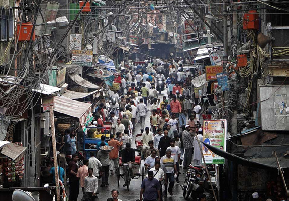
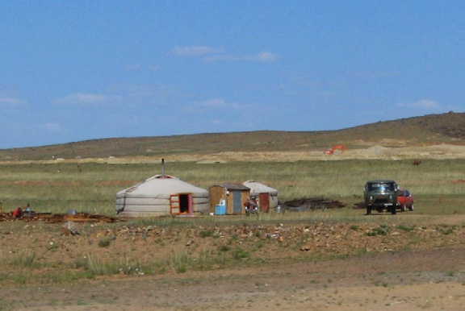
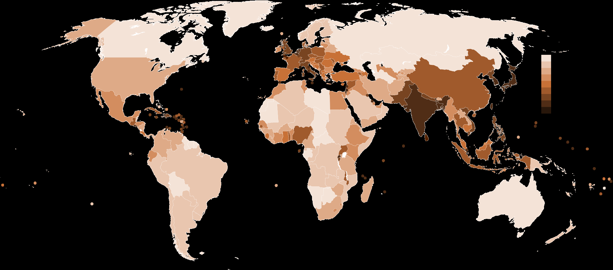

# Gerechte Verteilung

**Fach:** Geografie
**Stufe:** Sek 1
**Zeitbedarf:** ca. 60-90 Minuten

## Ausgangssituation

Auf der Erde gibt es fünf Ozeane, sieben Kontinente und ungefähr 7,01 Milliarden Menschen. Das steht fest.

### Gerecht?

Sicher ist auch, dass nicht alle dieser Menschen gleich viel Platz zur Verfügung haben. Das ist ungerecht.

Angenommen, diese ungleiche Verteilung sollte behoben werden: wie viele Quadratmeter „persönlicher" Raum würden jedem Erdenbürger gerechterweise zustehen? Wie weit auseinander würden die Menschen stehen, wenn sie gleichmässig über die ganze Landfläche der Erde verteilt würden?

Und wie würden sich diese Zahlen verändern, wenn es auf der Erde 10 Milliarden Menschen gäbe?

### Bevölkerungsdichte

- höchste Bevölkerungsdichte (Land): Macao, 20'319 Einwohner/km²
- höchste Bevölkerungsdichte (Stadtstaat): Monaco, 16'620 Einwohner/km²
- höchste Bevölkerungsdichte (Flächenstaat): Malta, 1'298 Einwohner/km²
- niedrigste Bevölkerungsdichte: Grönland, 0,025 Einwohner/km²
- dünnstbesiedelter Kontinent: Antarktis, 0,0001-0,0003 Einwohner/km²

Zum Vergleich: Deutschland 231 Einwohner/km², Österreich 99,5 Einwohner/km², Schweiz 183,9 Einwohner/km²

*Quelle: de.wikipedia.org/wiki/Bevölkerungsdichte*

## Material

*Wohnen in Indien...*

*...oder der Mongolei: sehr unterschiedliche Bevölkerungsdichten*

## Aufgabenstellung

**Wie viele Quadratmeter „persönlicher" Raum stünden jedem Menschen zu, wenn die Weltbevölkerung gleichmässig über die gesamte Landfläche der Erde verteilt würde? Wie weit auseinander würden die Menschen dabei stehen?**

**Wie verändern sich diese Werte bei 10 Milliarden Menschen?**

**Mögliche Denkrichtungen:**
- Welche Fläche hat die gesamte Landmasse der Erde (ohne Ozeane)?
- Sollten unbewohnbare Gebiete wie Wüsten, Gletscher oder Gebirge mitgezählt werden?
- Wie hängt die tatsächliche, sehr ungleiche Verteilung mit Klima, Wirtschaft und Geschichte zusammen?

---

**Konzept & Gestaltung:** David Halser | denkwerk.schule
**Lizenz:** CC-BY-SA
