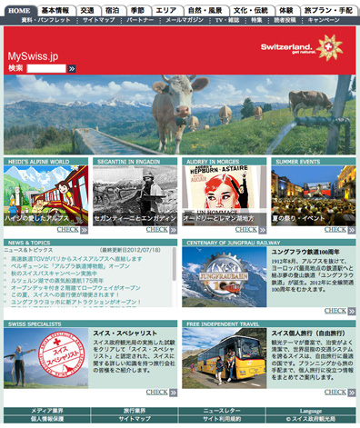
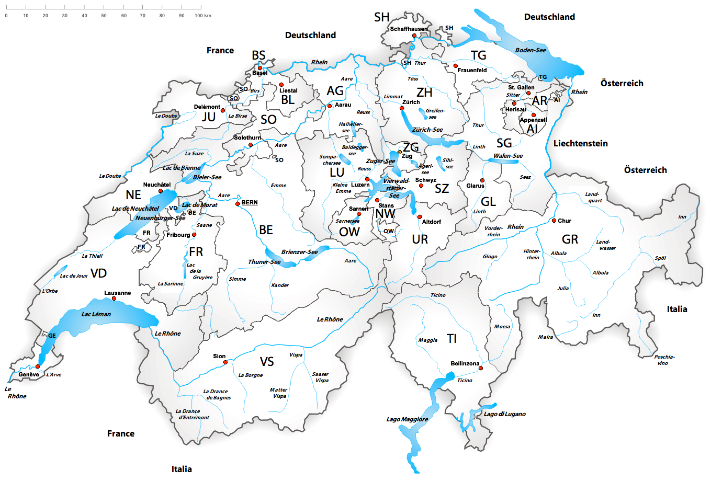

# Schweizerreise

**Fach:** Geografie
**Stufe:** Sek 1
**Zeitbedarf:** ca. 90-120 Minuten

## Ausgangssituation

Mit diesem Text empfängt die Homepage von myswitzerland.com Gäste aus Japan. Die Schweiz ist zwar ein kleines, aber durchwegs kein langweiliges Land und daher bei den reisefreudigen Japanerinnen und Japanern sehr beliebt.

### CH in three days

Leider sieht die durchschnittliche Schweiz-Reise für Gruppen aus Japan immer gleich aus: Zürich - Luzern - Jungfrau - Genf, und das in nur drei Tagen. Das sind sicher schöne Destinationen, aber sicher nicht die einzigen.

Um den Gästen aus Fernost - immer mehr reisen auch Touristen aus China, Singapur und Taiwan in die Schweiz - ein möglichst spannendes und vielfältiges Bild unseres Landes zu präsentieren, soll nun eine erweiterte Reiseroute entwickelt werden.

### CH in five days

Die neue erweiterte Tour de Swiss für Gäste aus Fernost soll sich an folgenden Eckwerten orientieren:

1. sie soll 5 volle Tage mit 4 Übernachtungen umfassen
2. sie soll mit dem öffentlichen Verkehr machbar sein
3. sie soll durch alle Sprachregionen führen
4. sie soll möglichst viele Sehenswürdigkeiten anfahren
5. sie soll sich an Erwachsene aus dem Mittelstand richten
6. sie soll nicht mehr als 1500.- CHF pro Person kosten

### Wettbewerb

myswitzerland.com hat einen Wettbewerb ausgeschrieben, bei dem es darum geht, Reiserouten mit den oben genannten Kriterien zusammenzustellen. Dem Sieger winkt eine Reise nach Japan.

Stellt in kleinen Teams ein möglichst attraktives Reiseprogramm zusammen und erstellt eine Reisedokumentation, welche alle wichtigen Angaben bezüglich Reiseroute, Fahrpläne, Fahrpreise, Übernachtungen, Museen (inkl. Öffnungszeiten und Eintrittspreise) enthält.

Viel Spass und gute Reise!

## Material

*Homescreen der japanischen Version von MySwiss.ch: myswiss.jp*

## Aufgabenstellung

**Erstellt in kleinen Teams eine 5-tägige Reiseroute durch die Schweiz für Gäste aus Fernost, die alle sechs Kriterien erfüllt, inklusive vollständiger Reisedokumentation.**

**Mögliche Denkrichtungen:**
- Welche Verbindungen zwischen den Sprachregionen sind mit dem öffentlichen Verkehr in vernünftiger Zeit machbar?
- Wie lassen sich die Kosten für Fahrt, Übernachtung und Eintritte innerhalb des Budgets von 1500 CHF pro Person halten?
- Welche Sehenswürdigkeiten zeigen ein möglichst vielfältiges Bild der Schweiz (Natur, Kultur, Städte, Sprachregionen)?

---

**Konzept & Gestaltung:** David Halser | denkwerk.schule
**Lizenz:** CC-BY-SA
