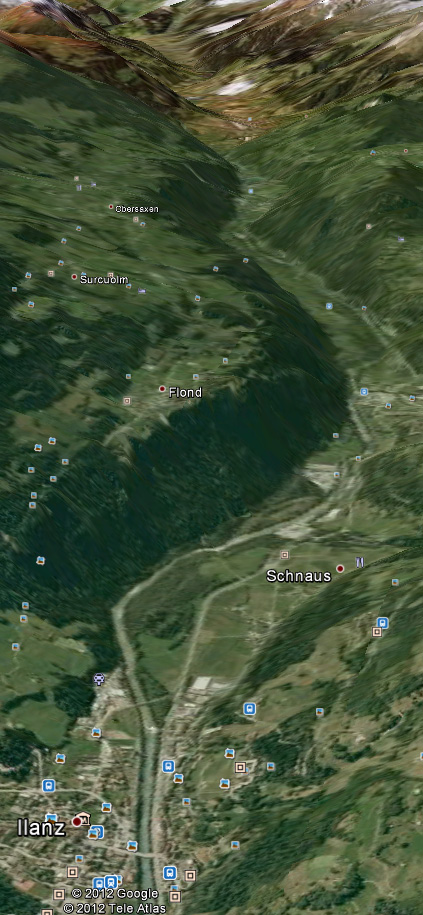
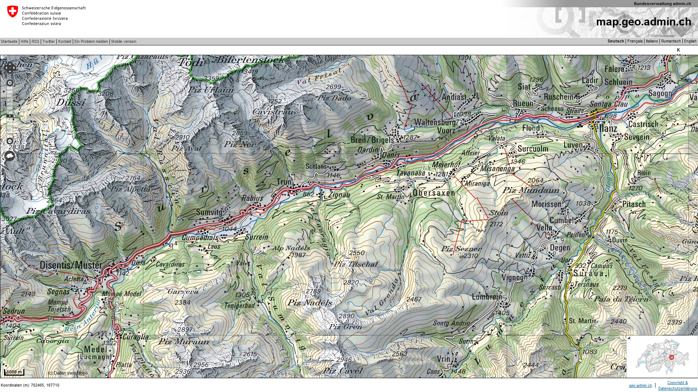

# Signalstafette

**Fach:** Geografie
**Stufe:** Sek 1
**Zeitbedarf:** ca. 60-90 Minuten

## Ausgangssituation

Bevor Philipp Reis 1861 die erste Telefonverbindung der Welt gelang, konnten die Menschen nur schriftlich über weite Distanzen miteinander kommunizieren.

### Signalstafette

Da Briefe aber ein ziemlich langsames Kommunikationsmittel sind, wurden eilige Mitteilungen - zum Beispiel der Ausbruch eines Krieges - oft mit Signalfeuern gemeldet. Schon die Kelten konnten sich mit Leuchtsignalen von gut sichtbaren Geländepunkten aus schnell Informationen über weite Strecken zukommen lassen.

### Das Experiment

Eine 6. Klasse aus der Surselva möchte überprüfen, ob sie mit ihren 16 Schülerinnen und Schülern zusammen in der Lage sei, eine einfache Botschaft mittels Signalfeuern von Ilanz bis nach Disentis zu übermitteln.

Die Schülerinnen und Schüler werden in Zweierteams eingeteilt. Hilf ihnen, dieses Experiment zu planen, indem du ihnen ideale Plätze mit guter Sichtverbindung vorschlägst.

Wäre eine Verbindung zwischen Ilanz und Disentis auch mit weniger Leuten herstellbar?

## Material

*Bildquelle: Google Earth*

*Quelle: map.geo.admin.ch*

## Aufgabenstellung

**Plane mit maximal 16 Personen (8 Zweierteams) eine Kette von Signalstationen mit guter Sichtverbindung zwischen Ilanz und Disentis. Wie viele Personen (Standorte) braucht es minimal für eine funktionierende Verbindung?**

**Mögliche Denkrichtungen:**
- Welche Geländepunkte zwischen Ilanz und Disentis bieten die beste gegenseitige Sichtverbindung?
- Wie weit reicht die Sichtweite eines Signalfeuers realistischerweise, und wovon hängt sie ab (Höhe, Wetter, Tageszeit)?
- Wie verändert sich die nötige Anzahl Stationen, wenn du die Route über die Höhenzüge statt durchs Tal planst?

---

**Konzept & Gestaltung:** David Halser | denkwerk.schule
**Lizenz:** CC-BY-SA
