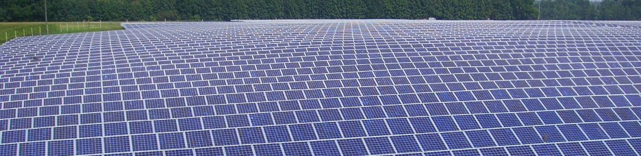
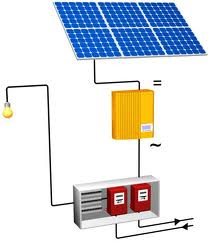
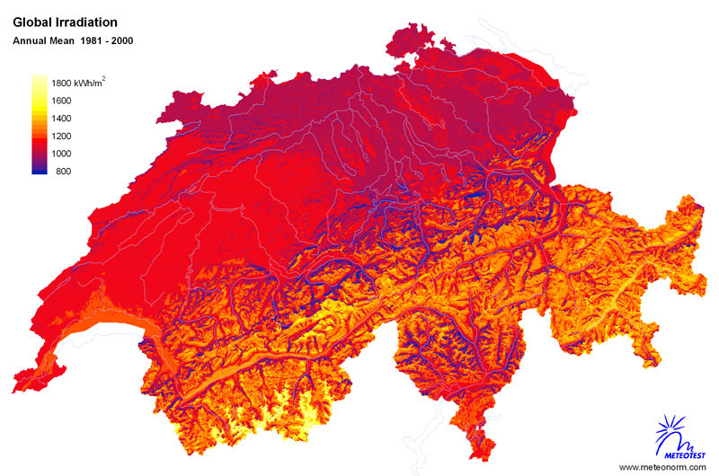

# Solarland Schweiz

**Fächer:** Geografie, Naturlehre
**Stufe:** Sek 1
**Zeitbedarf:** ca. 60-90 Minuten

## Ausgangssituation

Photovoltaikanlagen - besser bekannt als Solaranlagen - wandeln das Sonnenlicht direkt in elektrischen Strom um. Sie machen also aus Strahlungsenergie elektrische Energie. Dieses Modell galt lange als vielversprechende Zukunftslösung.

### Ehrgeiziges Ziel

Swissolar - der Fachverband für die Nutzung von Solarenergie in der Schweiz - hat sich zum Ziel gesetzt, bis ins Jahr 2035 20% des Strombedarfs durch Solarenergie zu gewinnen. Dazu wären 12m² Photovoltaik-Platten pro Einwohner nötig. Weitere spannende Informationen rund um das Thema Sonnenenergie findest du auf der Homepage von Swissolar unter swissolar.ch.

## Material

*Sonneneinstrahlungskarte für die Schweiz. Angaben in Kilowattstunden pro Quadratmeter und Jahr. Quelle: meteonorm/w-f.ch*

## Aufgabenstellung

**Wie gross müsste die Fläche eines Solarkraftwerkes sein, wenn der Strom aus allen Schweizer Kernkraftwerken durch Strom aus Photovoltaik ersetzt werden sollte? Welche Probleme müssten dabei berücksichtigt werden?**

**Mögliche Denkrichtungen:**
- Wie viel Strom produzieren die Schweizer Kernkraftwerke jährlich zusammen?
- Wie viel Energie liefert ein Quadratmeter Photovoltaik-Fläche pro Jahr, abhängig von der Sonneneinstrahlung am jeweiligen Standort?
- Wo in der Schweiz gäbe es überhaupt genug zusammenhängende, geeignete Fläche für ein solches Kraftwerk - und welche Konflikte (Landwirtschaft, Landschaftsschutz) entstünden dabei?

---

**Konzept & Gestaltung:** David Halser | denkwerk.schule
**Lizenz:** CC-BY-SA
