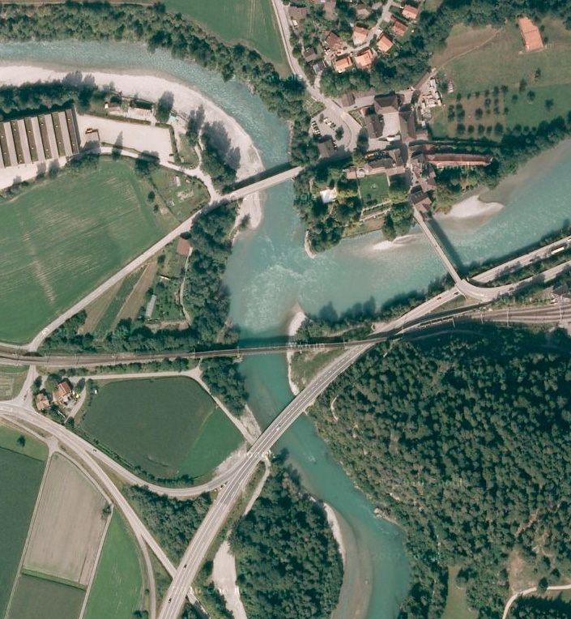
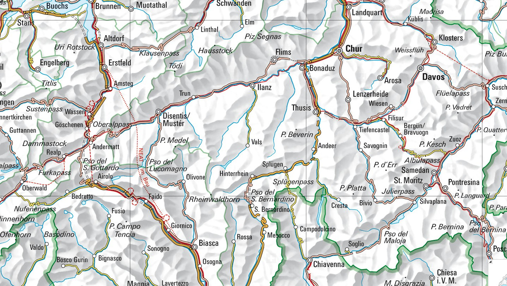

# Vorder- vs. Hinterrhein

**Fach:** Geografie
**Stufe:** Sek 1
**Zeitbedarf:** ca. 60-90 Minuten

## Ausgangssituation

In Reichenau fliessen der Vorderrhein und der Hinterrhein zusammen - ab hier bilden sie den Alpenrhein.

### Zwei Exkursionen

Im Park des Schlosses Reichenau treffen sich zwei Klassen - eine aus Sedrun, die andere aus Splügen. Beide haben im Geografie-Unterricht den Rhein behandelt und sind nun auf einer Exkursion zu diesem Thema.

Schnell kommen sie miteinander ins Reden und schon bald behaupten beide Klassen, „ihr" Rhein sei der grössere von beiden. Da sie sich nicht einigen können und auch ihre Lehrer keine genaue Antwort geben können, schliessen sie eine Wette.

## Material

*Übersichtskarte über das Einzugsgebiet des Vorder- und des Hinterrheines. Quelle: http://map.geo.admin.ch/*

## Aufgabenstellung

**Welche der beiden Klassen wird gewinnen? Begründet eure Antwort!**

**Mögliche Denkrichtungen:**
- Was macht einen Fluss „grösser" - Länge, Wassermenge, Einzugsgebiet?
- Welche Daten braucht ihr, um die Wette zu entscheiden?
- Woher stammt das Wasser des Vorderrheins, woher jenes des Hinterrheins?

---

**Konzept & Gestaltung:** David Halser | denkwerk.schule
**Lizenz:** CC-BY-SA
