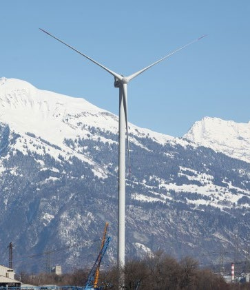
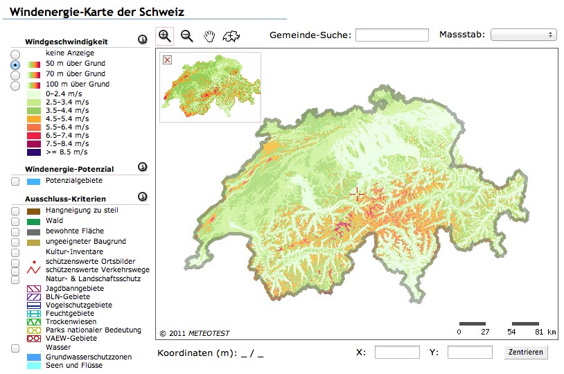

# Windenergie

**Fach:** Geografie
**Stufe:** Sek 1
**Zeitbedarf:** ca. 60-90 Minuten

## Ausgangssituation

Windkraft gehört in Norddeutschland schon längst zu den erfolgreichen alternativen Energielieferanten. An das Bild der Windparks hat man sich gewöhnt.

### Windkraft in GR

Seit kurzem hat auch Graubünden sein erstes Windrad. Es steht auf dem Gebiet der Gemeinde Haldenstein und kann praktisch das ganze Dorf mit Strom versorgen.

### Ausbaupotenzial?

Doch damit ist das Potenzial dieser zukunftsträchtigen Energiequelle noch lange nicht ausgeschöpft.

## Material

*Windkraftwerk in Haldenstein.*

*Interaktive Windkarte der Schweiz. Quelle: wind-data.ch/windkarte*

## Aufgabenstellung

1. Berechne, wie viele Windräder vom Typ, wie er in Haldenstein steht, nötig wären, um die ganze Surselva mit Strom zu versorgen.
2. Überlege dir auch, wo diese sinnvollerweise aufgestellt werden könnten.
3. Was würdest du persönlich von einer solchen Lösung halten? Ökologisch o.k., oder landschaftlich bedenklich? Argumentiere!
4. Wie gross ist die Menge an Erdöl, welche dieses eine Windrad in Haldenstein pro Jahr zu ersetzen hilft?

Bearbeitet die verschiedenen Fragestellungen in eurer Gruppe so, dass ihr eure Ergebnisse im Plenum vorstellen könnt. Begründet eure Antworten und legt eure Quellen offen!

---

**Konzept & Gestaltung:** David Halser | denkwerk.schule
**Lizenz:** CC-BY-SA
