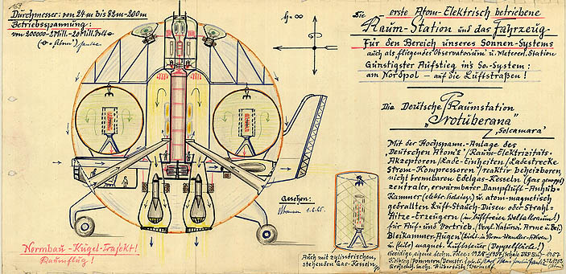

# Wichtige Erfindungen

**Fach:** Geschichte
**Stufe:** Sek 1
**Zeitbedarf:** ca. 60-90 Minuten

## Ausgangssituation

Wir leben heute in der modernsten Welt, die es je gab. Aber: Das dachten die Menschen schon immer. Und jede Welt war zu ihrer Zeit einmal die modernste...

### Das beste aller Zeiten!

Das ist der beste Film aller Zeiten! Das schnellste Auto aller Zeiten! Die teuerste Jacht aller Zeiten! Und so weiter und so fort. Wir lieben Rekorde. Aber macht es Sinn, von „allen Zeiten" zu reden, wenn es Filme, Autos, Jachten erst seit rund 150 Jahren (oder noch weniger!) gibt?

### Menschliche Errungenschaften

Welche menschlichen Errungenschaften, anders gesagt Erfindungen, waren aber wirklich bahnbrechend - sprichwörtlich für alle Zeiten - weil sie unser Leben so nachhaltig verändert haben, dass die Welt nachher wirklich für immer eine andere wurde?

### Top Ten...

Der menschliche Erfindergeist hat wahrlich schon viel Nützliches, Erstaunliches und Geniales zutage gebracht - auch wenn der eine oder andere Flopp dabei war. Aber was sind nun wirklich die TOP TEN Errungenschaften der Menschheit? Welche Erfindungen haben unser Leben am nachhaltigsten verändert? Begründe deine Favoritenliste!

## Material

*Eine von hunderten Zeichnungen und Bauplänen für ein (damals) futuristisches Raumfahrtvehikel des deutschen Querdenkers und Erfinders Karl Hans Janke. Während die NASA an ähnlichen Raumfähren rumtüftelte, landete Janke in einer psychiatrischen Anstalt der DDR. Seine rund 400 Erfindungen wurden erst Jahre nach seinem Tod entdeckt.*

## Aufgabenstellung

**Stelle deine persönliche TOP-TEN-Liste der wichtigsten Erfindungen der Menschheit zusammen und begründe deine Reihenfolge.**

**Mögliche Denkrichtungen:**
- Was unterscheidet eine „bahnbrechende" Erfindung von einem blossen Rekord oder einer Mode-Erscheinung?
- Wie hätte sich die Welt ohne diese Erfindung entwickelt?
- Warum wurden manche geniale Erfindungen (wie die von Karl Hans Janke) zu ihrer Zeit nicht anerkannt?

---

**Konzept & Gestaltung:** David Halser | denkwerk.schule
**Lizenz:** CC-BY-SA
