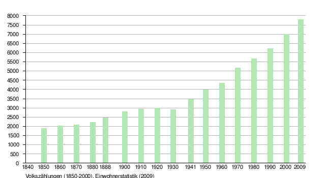
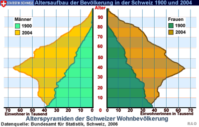

# Die Schweiz 2040

**Fächer:** Geschichte, Geografie
**Stufe:** Sek 1
**Zeitbedarf:** ca. 90-120 Minuten

## Ausgangssituation

Die Schweiz - das ist 1 Land, 4 Sprachen, fünf Nachbarn, 26 Kantone, hunderte Berge und Täler, 1800 km Grenze, 42'000 km² Fläche und über 8'000'000 Menschen.

### Bevölkerungsentwicklung

Diese Aufzählung wird sich auch im Jahr 2050 noch fast gleich lesen - ausser die Sache mit den Einwohnern. Diese Zahl ist einem permanenten Wandel unterworfen, das zeigt ein Blick zurück in die jüngere Geschichte der Schweiz.

### Faktoren

Vier Faktoren beeinflussen die Bevölkerungsentwicklung: Die Geburten- und die Sterbeziffer sowie die Ein- und die Auswanderung. Während die Geburtenziffer und die Einwanderung die Einwohnerzahl eines Landes steigen lassen, führen die Sterbeziffer und die Auswanderung zu sinkenden Zahlen.

### Szenarien

Niemand kann die Zukunft genau voraussehen - aber man kann sich Überlegungen anstellen, wie sie wohl aussehen könnte. Wie hoch ist wohl die Bevölkerungszahl der Schweiz im Jahr 2040?

## Material

*Volkszählungen (1850-2000), Einwohnerstatistik (2009)*

*Altersaufbau (Alterspyramide) der Schweizer Wohnbevölkerung 1900 vs. 2004. Quelle: Bundesamt für Statistik, Schweiz 2006*

## Aufgabenstellung

**Entwickle unter Berücksichtigung von möglichst vielen Faktoren drei glaubwürdige Szenarien für die Bevölkerungsbilanz 2040 und berechne diese auch.**

**Präsentiere deine Überlegungen inklusive Denkweg und Quellen der ganzen Klasse - in einer PowerPoint oder auf einem Plakat. Überlege dir auch für jedes dieser Szenarien, wo seine Vor- und Nachteile für die Schweiz liegen könnten.**

**Mögliche Denkrichtungen:**
- Wie haben sich Geburtenziffer, Sterbeziffer und Migration in den letzten Jahrzehnten entwickelt - und wie könnten sie sich weiterentwickeln?
- Was würde ein „optimistisches", ein „pessimistisches" und ein „neutrales" Szenario jeweils annehmen?
- Welche gesellschaftlichen, wirtschaftlichen oder politischen Folgen hätte jedes Szenario?

---

**Konzept & Gestaltung:** David Halser | denkwerk.schule
**Lizenz:** CC-BY-SA
