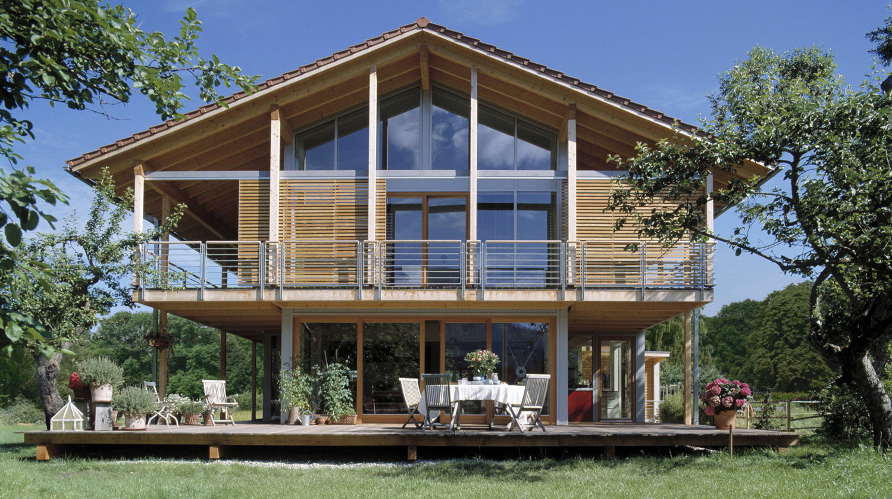
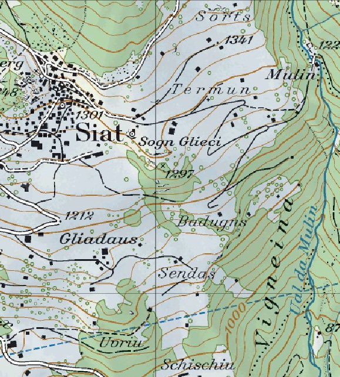
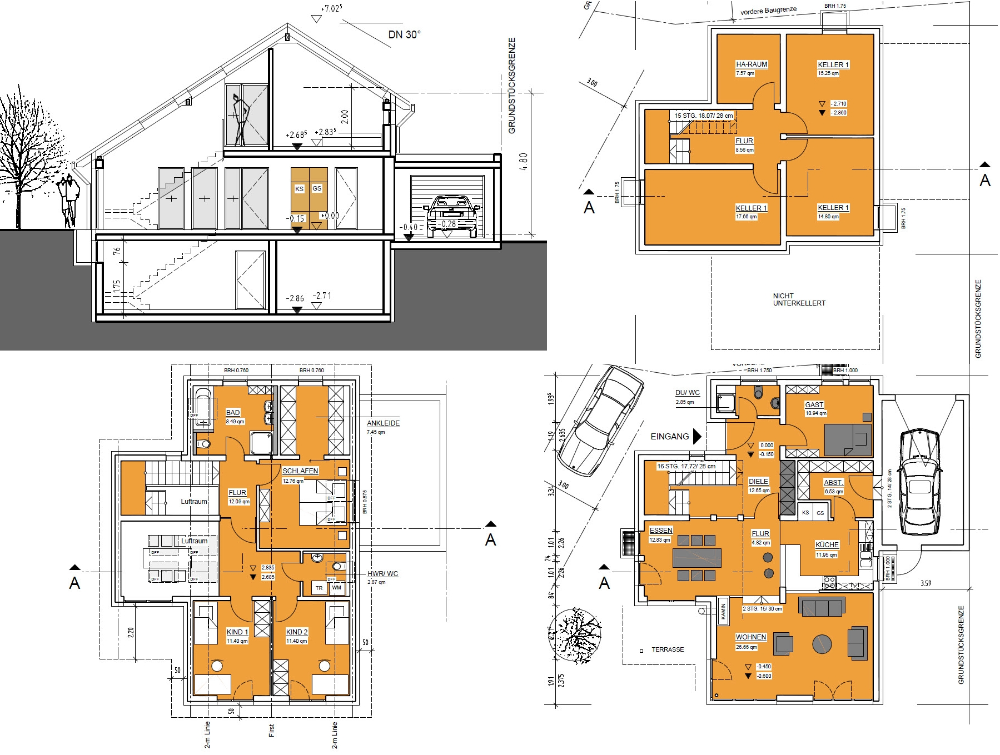

# Öko-Einfamilienhaus

**Fächer:** Mathematik, Geografie
**Stufe:** Sek 1
**Zeitbedarf:** ca. 90-120 Minuten

## Ausgangssituation

Familie Caspari plant, leicht ausserhalb des Dorfes ein modernes Öko-Einfamilienhaus zu bauen. Um es so ökologisch wie möglich zu gestalten und um die teuren Erschliessungsgebühren für die Wasserversorgung zu sparen, ist eine autonome Wasserversorgung mit einem Regenwassersammler und einem Aufbereitungssystem geplant, wie es die Caritas auch in Drittweltländern einsetzt.

### Das Haus

Die Casparis haben 3 Kinder im schulpflichtigen Alter: Flurin ist 15, Ladina 12 und Fabio 7 Jahre alt. Der Labrador Sam gehört auch noch zur Familie. Auch wenn sie keinen übertriebenen Luxus brauchen, möchten sie doch ein Badezimmer mit WC, Doppellavabo und Badewanne, ein separates Gäste-WC mit Lavabo und eine Dusche im Erdgeschoss. Eine Geschirrspülmaschine in der Küche soll auch nicht fehlen. Ein zusätzliches Lavabo und eine Waschmaschine stehen in der Waschküche. Im Aussenbereich sind zwei Anschlüsse für Gartenschläuche geplant.

## Material

*Gebäudegrundriss und Lageplan der Bau-Parzelle.*

## Aufgabenstellung

**Ist ein solches Haus ohne externen Wasseranschluss in der Surselva überhaupt realisierbar?**

**Wie gross müssen die Regensammelfläche und der Wassertank mindestens sein, damit auch längere Trockenzeiten problemlos überstanden werden können? Begründe deine Überlegungen.**

**Mögliche Denkrichtungen:**
- Wie viel Wasser verbraucht eine 5-köpfige Familie mit den beschriebenen sanitären Einrichtungen pro Tag?
- Wie viel Niederschlag fällt in der Region Surselva durchschnittlich pro Jahr, und welche Dachfläche steht als Sammelfläche zur Verfügung?
- Wie lange dauert die längste zu erwartende Trockenperiode, und wie gross muss der Tank sein, um diese zu überbrücken?

---

**Konzept & Gestaltung:** David Halser | denkwerk.schule
**Lizenz:** CC-BY-SA
