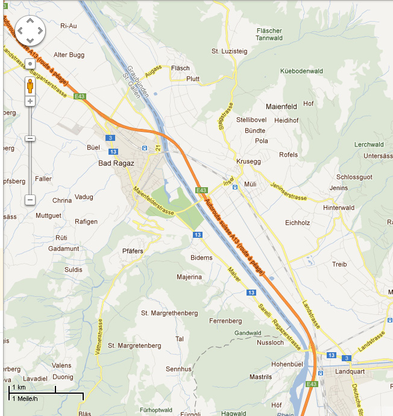
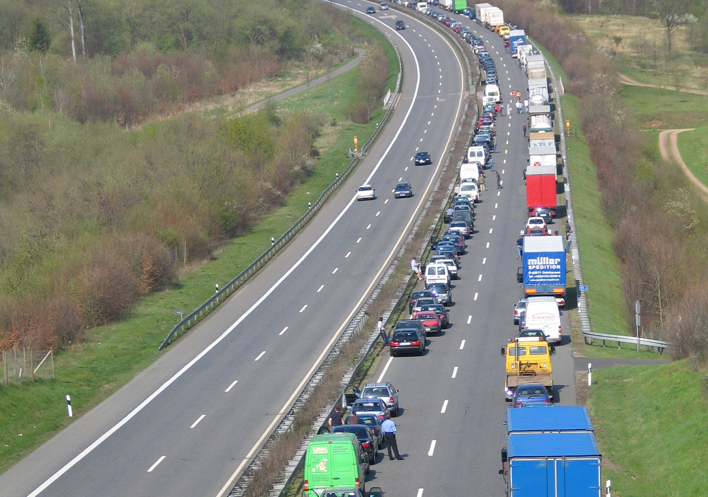

# Stau auf der Autobahn

**Fach:** Mathematik
**Stufe:** Sek 1
**Zeitbedarf:** ca. 45-60 Minuten

## Ausgangssituation

Verkehrsmeldung von DRS:

### Stau bei Landquart

Aktuelle Staumeldung von 08.35 Uhr: Für die Region Graubünden melden Verkehrsteilnehmer einen Stau auf der A13 vor der Ausfahrt Landquart in Fahrtrichtung Süden. Wegen eines Unfalls stauen sich die Fahrzeuge bis zur Raststätte Heidiland. Achtung, das Stau-Ende liegt an einer unübersichtlichen Stelle auf der Rheinbrücke. Der Stau wird voraussichtlich noch bis 10 Uhr dauern, eine Umleitung ist signalisiert.

## Material

## Aufgabenstellung

**Wie viele Personen stecken in diesem Stau fest? Begründe deine Überlegungen.**

**Mögliche Denkrichtungen:**
- Wie lang ist die Strecke zwischen der Unfallstelle und der Raststätte Heidiland?
- Wie viele Fahrzeuge stehen durchschnittlich pro Kilometer in einem Stau (Fahrzeuglänge + Sicherheitsabstand im Stillstand)?
- Wie viele Personen sitzen im Schnitt in einem Fahrzeug?

---

**Konzept & Gestaltung:** David Halser | denkwerk.schule
**Lizenz:** CC-BY-SA
