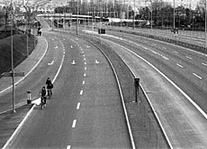
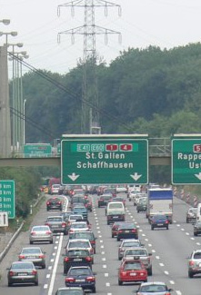
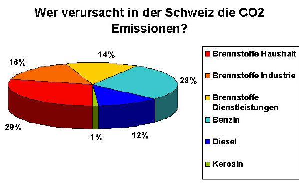

# Autofreier Sonntag

**Fach:** Naturlehre
**Stufe:** Sek 1
**Zeitbedarf:** ca. 60-90 Minuten

## Ausgangssituation

Die Schweiz ist zwar kein grosses Land, aber ein ziemlich mobiles. Wir Schweizer sind Weltmeister im Zug fahren und auch ziemlich oft im Auto unterwegs. Das ist zwar bequem, praktisch und schnell, aber belastet die Umwelt ziemlich stark.

### Sparpotenzial

Der motorisierte Individualverkehr macht immerhin rund 40% des jährlichen anthropogenen (= von Menschen verursachten) CO2-Ausstosses in der Schweiz aus. Darauf können wir heute kaum noch verzichten, zu sehr hängt unser Lebensstil und unsere Wirtschaft von der Mobilität ab.

Aber ein kleines spannendes Gedankenexperiment „was-wäre-wenn" kann doch einmal angestellt werden:

### Gedankenexperiment

Stell dir einmal vor, in der ganzen Schweiz würde ein autofreier Sonntag verordnet. Übrigens: das gab es bereits einmal, in den 70er Jahren, als das Erdöl wegen einer politischen Krise im Nahen Osten plötzlich sehr viel teurer wurde.

Also angenommen, an einem Sonntag würden in der ganzen Schweiz alle Autos stehen und die ganzen Autobahnen leer bleiben, alle Strassen innerorts würden sich in Fussgängerzonen verwandeln - das wäre nicht nur eine recht interessante Erfahrung, sondern hätte auch grosses Sparpotenzial - sowohl in Bezug auf den Treibstoffverbrauch, wie auch auf den CO2-Ausstoss und das Geld.

## Material

*Autobahn bei Bern, 25.11.1973*

## Aufgabenstellung

**Wie viel CO2, Treibstoff und Geld könnte die Schweiz an einem einzigen autofreien Sonntag tatsächlich sparen? Rechne mit realistischen Annahmen und begründe dein Vorgehen.**

**Mögliche Denkrichtungen:**
- Wie viele Kilometer fahren die Schweizerinnen und Schweizer an einem durchschnittlichen Sonntag mit dem Auto?
- Welchen Anteil daran hat Freizeitverkehr, welchen Pendlerverkehr?
- Was würde ein autofreier Sonntag für die Wirtschaft bedeuten - nur Nachteile oder auch Vorteile?

---

**Konzept & Gestaltung:** David Halser | denkwerk.schule
**Lizenz:** CC-BY-SA
