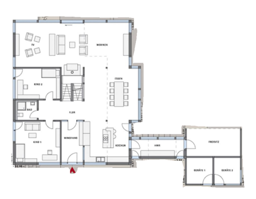
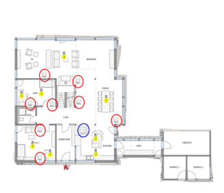

# Elektrische Schaltung

**Fach:** Naturlehre
**Stufe:** Sek 1
**Zeitbedarf:** ca. 90-120 Minuten

## Ausgangssituation

Baue Schaltungen in ein Haus ein! Du musst die Stromschaltungen in einem Haus planen. Achte dabei auch auf die Sicherheit. Das Wissen, welches du in den Aufträgen zum Strom erarbeitet hast, hilft dir dabei.

### Auftrag

Den Hauptauftrag findest du unten. Lies ihn gut durch! Bei Fragen wende dich an deine Lehrperson. Versuch nun das Gelernte anzuwenden. Berate dich mit Mitschülern. Schüler der 1. TK dürfen sich an die „Grösseren" wenden.

### Hauptauftrag

Studiere zuerst den Plan und orientiere dich, wo was ist. Die Lampen sollen mit Schaltern bedient werden.

## Material

## Aufgabenstellung

1. Die Kinderzimmer 1 und 2 sollen mit zwei unabhängig voneinander einschaltbaren Lampen ausgestattet werden.
2. In der Küche soll ein doppelter Schalter für zwei unabhängige Lampen installiert werden (blau).
3. Der Essbereich soll vom Küchenübergang sowie vom Treppenhaus aus beliebig und unabhängig voneinander ein- und ausgeschaltet werden können.
4. Das Wohnzimmer soll vom Wohnzimmer selbst sowie vom Übergang vom Essbereich und Wohnzimmer aus beliebig und unabhängig voneinander ein- und ausgeschaltet werden können.
5. In der Werkstatt möchtest du deine Fräse so installieren, dass diese nur läuft, wenn die Ventilation auch läuft. So verhinderst du Staubentwicklung.
6. Du hängst Backofen, Mikrowelle, Kühlschrank, Ventilation Küche, Fräse in Werkstatt, Ventilation in Werkstatt, Kreissäge und Standbohrer an die Leitung. Welche Schaltung wählst du? Welches Problem kann dabei auftreten? Wie kann man das lösen?
7. Zeichne einen Schaltplan. Benutze dabei die gelernten Zeichen für die Schaltungen.

**Mögliche Denkrichtungen:**
- Welche Schaltungsart (Serie-, Wechsel-, Kreuzschaltung) brauchst du für welche der obigen Anforderungen?
- Wie stellst du sicher, dass beim Anschliessen mehrerer Grossverbraucher (Punkt 6) die Sicherung nicht auslöst?
- Wie lässt sich die Abhängigkeit „Fräse läuft nur, wenn Ventilation läuft" (Punkt 5) schaltungstechnisch umsetzen?

---

**Konzept & Gestaltung:** TalentSchule.Surselva | denkwerk.schule
**Lizenz:** CC-BY-SA
