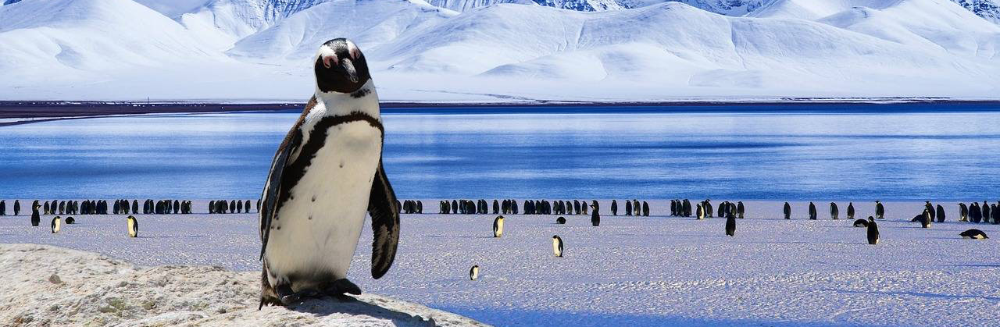
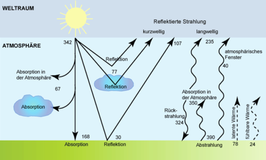

# Energiehaushalt Erde

**Fächer:** Naturlehre, Geografie
**Stufe:** Sek 1
**Zeitbedarf:** ca. 45-60 Minuten

## Ausgangssituation

Die Erde bekommt von der Sonne laufend Energie in Form von Strahlungsenergie. Damit sich die Erde nicht permanent aufheizt, sondern in einem Gleichgewicht steht, muss auch Wärme wieder abgegeben werden. Das Gleichgewicht des Energiehaushaltes der Erde ist unten dargestellt.

Dir ist bekannt, dass es am Äquator am wärmsten ist und die Temperatur Richtung Pole immer mehr abnimmt.

## Material

*Grafische Darstellung: Energiehaushalt der Erde*

## Aufgabenstellung

**Warum gibt es diesen Temperaturunterschied zwischen den Polen und dem Äquator?**

**Warum werden die Pole nicht permanent kälter und die Region um den Äquator nicht permanent wärmer?**

**Mögliche Denkrichtungen:**
- Wie verändert sich der Einfallswinkel der Sonnenstrahlen je nach geografischer Breite?
- Was zeigt dir das Diagramm zum Energiehaushalt über Absorption, Reflexion und Abstrahlung?
- Welche Rolle spielen Luft- und Meeresströmungen beim Ausgleich der Temperaturunterschiede?

---

**Konzept & Gestaltung:** TalentSchule.Surselva | denkwerk.schule
**Lizenz:** CC-BY-SA
