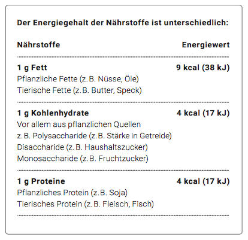

# Energieumsatz

**Fach:** Naturlehre
**Stufe:** Sek 1
**Zeitbedarf:** ca. 60-90 Minuten

## Ausgangssituation

Um das Rechnen etwas zu vereinfachen, beschränken wir den Energieumsatz auf den Grundumsatz und den Leistungsumsatz.

### Masseinheiten

Physikalisch handelt es sich um Arbeit pro Zeit, also Leistung. Einheit ist daher Joule pro Sekunde (J/s) oder Watt (W). In der Praxis wird allerdings weiterhin meist die Einheit Kilokalorien gebraucht.

**Formel:**
1 kcal = 4.186 kJ
1 kJ = 0.239 kcal

## Material

*Der Energiegehalt der Nährstoffe ist unterschiedlich (Fett, Kohlenhydrate, Proteine)*

Auf sportunterricht.ch (http://www.sportunterricht.ch/Theorie/Energie/energie.php) kannst du deinen Grundumsatz und deinen gesamten Energieumsatz berechnen.

### Faustregel

Grobe Faustformel zum Energieverbrauch:

- 1g Fett benötigt 2 min. zum Abbau (110sec Gehen, 150sec mittleres Radfahren)
- 1g Kohlenhydrat benötigt 1 min. zum Abbau (50sec Gehen, 60sec Radfahren)

## Aufgabenstellung

- Berechne deinen Grundumsatz mit der Formel.
- Berechne deinen Energieumsatz, indem du alle Werte in das Online-Formular einträgst.
- Berechne die Differenz von deinem berechneten Grundumsatz und des berechneten Energieumsatzes. So erhältst du den Leistungsumsatz.
- Stelle nun einen gesunden und einen ungesunden Menüplan (je 3 Haupt- und 2 Zwischenmahlzeiten) zusammen, welcher deinen Energieumsatz abdeckt.
- Was müsstest du aus deinem Menüplan streichen, wenn du keinen Sport betreiben würdest, damit dein Energieumsatz im Gleichgewicht ist? Rechne dafür nochmals den Energieumsatz aus. Der Grundumsatz bleibt ja derselbe.

---

**Konzept & Gestaltung:** TalentSchule.Surselva | denkwerk.schule
**Lizenz:** CC-BY-SA
