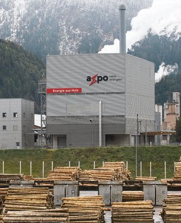
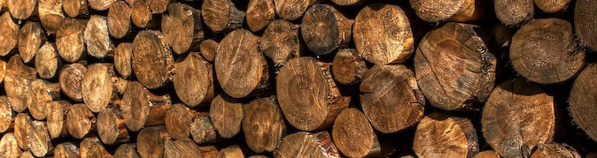
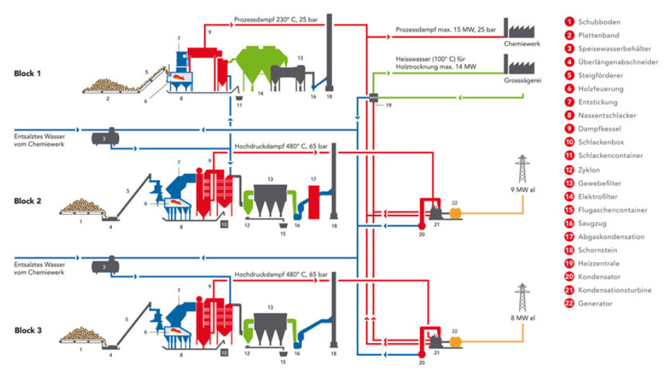

# Strom aus Holz

**Fach:** Naturlehre
**Stufe:** Sek 1
**Zeitbedarf:** ca. 60-90 Minuten

## Ausgangssituation

Die jährlichen Produktionswerte der Axpo Tegra AG in Domat/Ems sind eindrücklich: Sie kann aus 170'000 Tonnen Holzschnitzeln und 50'000 Tonnen Altholz rund 136'000 Megawattstunden (MWh) Strom sowie 220'000 MWh Heizenergie produzieren. Mit dieser Kraftwärmekoppelung (Stromproduktion und Wärmenutzung) erzielt die Anlage einen hohen Gesamtwirkungsgrad.

### Pläne für Ilanz

Zusammen mit den Zürcher Kraftwerken ZKW und privaten Investoren plant die Stadt Ilanz/Glion ein ähnliches Holzkraftwerk.

Wie viel Holz würde benötigt, um die ganze Stadt ein Jahr lang mit Strom zu versorgen?

Wie lange dauert es, bis diese Holzmenge gewachsen ist?

Wie gross müsste das Einzugsgebiet für die Holzlieferungen sein, um diese Menge liefern zu können?

## Material

## Aufgabenstellung

**Wie viel Holz würde benötigt, um die Stadt Ilanz/Glion ein Jahr lang mit Strom zu versorgen? Wie lange dauert es, bis diese Holzmenge nachgewachsen ist, und wie gross müsste das Einzugsgebiet für die Holzlieferungen sein?**

**Mögliche Denkrichtungen:**
- Wie viel Strom verbraucht die Stadt Ilanz/Glion pro Jahr, und wie lässt sich das aus den Werten der Anlage in Domat/Ems hochrechnen?
- Wie viel Holz wächst pro Hektare Wald durchschnittlich pro Jahr nach?
- Welche zusätzlichen Faktoren (Transportwege, andere Nutzungen des Holzes) müssten in der Praxis noch berücksichtigt werden?

---

**Konzept & Gestaltung:** David Halser | denkwerk.schule
**Lizenz:** CC-BY-SA
