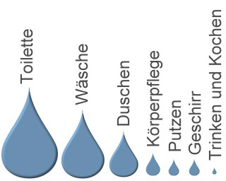

# Wasser sparen

**Fächer:** Geografie, Naturlehre
**Stufe:** Sek 1
**Zeitbedarf:** ca. 60-90 Minuten

## Ausgangssituation

Unter Wasserverbrauch versteht man die Summe der von Menschen verwendeten Wassermenge. Diese umfasst nicht nur das Trinkwasser, sondern auch das im Alltag (Duschen, Waschen, Kochen, ...) und in der Wirtschaft verbrauchte Wasser.

### Wasserverbrauch

Sauberes Wasser ist kostbar und kostet daher auch etwas. Durch einen Wasserzähler wird daher in jedem Haushalt der reale Wasserverbrauch gemessen. Diese Zahlen werden dann zur Berechnung der Kosten verwendet. Der Anteil der Personenhaushalte am Gesamtverbrauch beträgt in Europa ungefähr 10% bis 15% des genutzten Wasserangebots. Der grosse Rest entfällt auf Industrie und Landwirtschaft.

### Wasser sparen

Die Familie Decurtins bewohnt ein modernes, nach ökologischen Gesichtspunkten gebautes Einfamilienhaus an einer schönen Lage in der Surselva. Zur Familie gehören Vater Pieder (47), Mutter Carla (45), die Söhne Flurin (18) und Gian (12) und die Tochter Ladina (15).

Da sie das ganze Haus schon konsequent auf Energiesparlampen umgerüstet haben, möchten sie nun auch ihren Wasserverbrauch noch reduzieren. Damit schonen sie nicht nur die Umwelt, sondern sparen auch Geld. Um die Bereitschaft der ganzen Familie, beim Wassersparen aktiv mitzumachen, noch zu steigern, hat Mutter Carla eine gute Idee: Das Geld, dass sie innerhalb eines Jahres beim Wasserverbrauch einsparen, wird in einen Familienausflug investiert.

Als erste Massnahme beschliessen sie, beim WC anzufangen, denn dort wird der grösste Teil des Haushaltswassers verbraucht:

Um die Wassermenge pro Vollspülung zu reduzieren, legen sie einen Ziegelstein in jeden Spülkasten ihres Hauses.

## Aufgabenstellung

**Wieviel Geld wird diese Massnahme der Familie Decurtins in einem Jahr ungefähr einsparen? Begründe deine Aussage.**

**Mögliche Denkrichtungen:**
- Wie viel Wasser verdrängt ein Ziegelstein im Spülkasten pro Spülung?
- Wie oft wird pro Person und Tag durchschnittlich gespült?
- Was kostet ein Kubikmeter Trinkwasser (inkl. Abwasser) in deiner Gemeinde?

---

**Konzept & Gestaltung:** David Halser | denkwerk.schule
**Lizenz:** CC-BY-SA
