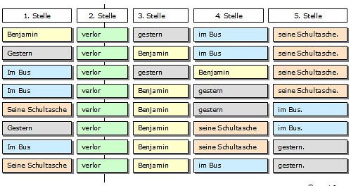
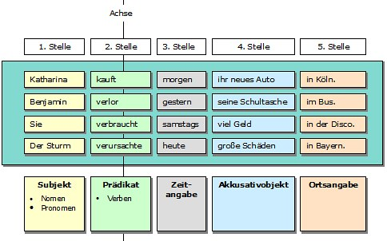

# Satzproben anwenden

**Fach:** Deutsch
**Typ:** Baustein für den eigenständigen Kompetenzaufbau

Wie man Satzglieder mit Verschiebe- und Ersatzprobe sicher bestimmt.

## Ausgangslage

Wortgruppen, die in ihrer Gesamtheit als Gruppe untereinander austauschbar, verschiebbar und ersetzbar sind, bilden zusammen ein Satzglied. Um diese voneinander abzugrenzen, gibt es verschiedene Satzproben.

## Schritte

### Verschiebeprobe

Mit der Verschiebeprobe, auch Umstellprobe genannt, kann man erkennen, welche einzelnen Wörter oder Wortgruppen in einem Satz nur gemeinsam an eine andere Stelle verschoben werden können, ohne dass sich dabei der Sinn des Satzes mehr als geringfügig verändert. Von den dadurch in einem Satz ermittelten Satzgliedern kann lediglich die finite Verbform (Zweitstellung im Aussagesatz, Spitzenstellung im Fragesatz ohne Fragepronomen und Endstellung im Nebensatz), die das Prädikat (Satzaussage) bildet, nicht verschoben werden.

**So geht es:** Das in der Reihenfolge der Satzglieder an zweiter Stelle stehende Prädikat (finite Verbform) stellt die Achse dar, um die die anderen Satzglieder verschoben werden können. Wenn das Prädikat mehrteilig ist (z. B. finite Verbformen im Perfekt wie: er hat gefragt), dann "drehen sich" die übrigen Satzglieder um die an zweiter Stelle stehende Personalform des Verbs, während die übrigen Prädikatsteile am Ende des Satzes stehen.

### Ersatzprobe

Bei der Ersatzprobe, die auch Austauschprobe genannt wird, geht es darum, festzustellen, welche Wörter oder Wortgruppen in einem Satz durch andere ersetzt werden können. Ist dies der Fall, handelt es sich um Satzglieder. So kann jedes der untereinander aufgelisteten Satzteile als Satzglied für das andere verwendet werden, auch wenn dies natürlich von der Bedeutung des Satzes her gesehen keinen Sinn macht - es geht ja nur darum, dass die gleichartigen Satzglieder jeweils an die Stelle des anderen treten könnten.

Hier gilt die Faustregel: Eine Wortgruppe, die durch ein einziges Wort ersetzt werden kann, gehört als Satzglied zusammen.

## Beispiele

Der grosse Schneemann vor dem Küchenfenster ist geschmolzen. -> Er ist geschmolzen - damit ist klar, dass "der grosse Schneemann vor dem Küchenfenster" zusammengehört.

Wir trafen sie in der Unterführung des neuen Bahnhofgebäudes. -> Wir trafen sie dort - damit ist klar, dass "in der Unterführung des neuen Bahnhofgebäudes" zusammengehört.

---

**Konzept & Gestaltung:** David Halser | denkwerk.schule
**Lizenz:** CC-BY-SA
