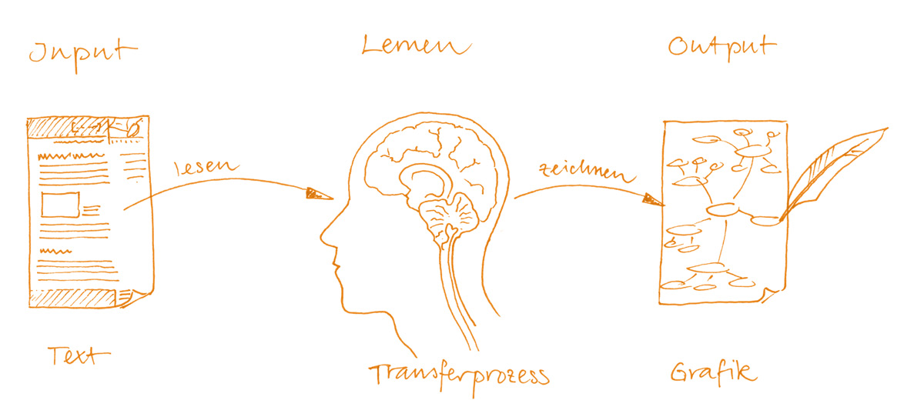
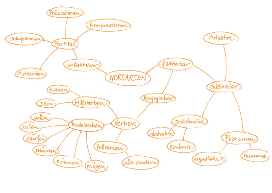
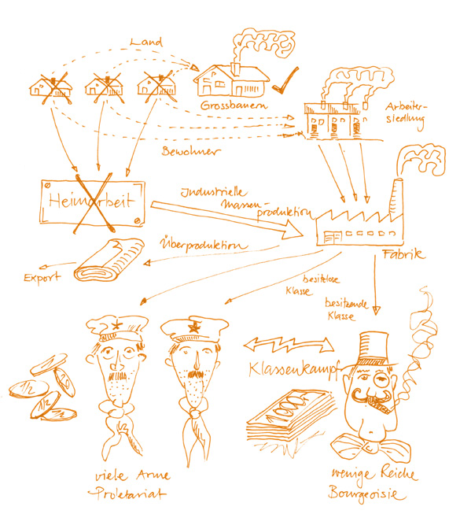
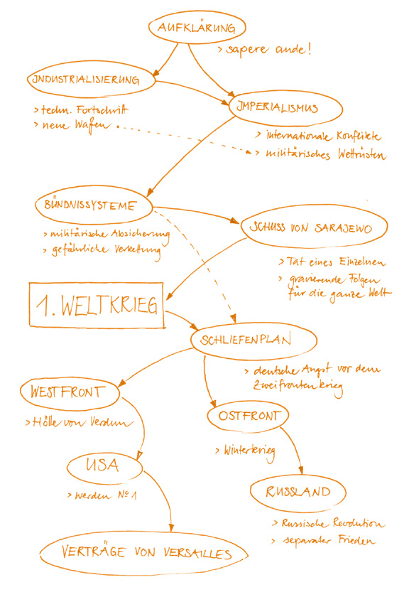

# Texte visualisieren

**Fach:** Deutsch
**Typ:** Baustein für den eigenständigen Kompetenzaufbau

Wissen transformieren: vom gelesenen Text zur eigenen Grafik.

## Ausgangslage

Lernen heisst, sich fremdes Wissen so zu eigen zu machen, dass es später und in anderen Zusammenhängen wieder verfügbar ist. Reines Auswendiglernen führt zu trägem Faktenwissen, das sich kaum auf andere Situationen anwenden lässt. Um die heute geforderten Qualitäten von Dauerhaftigkeit und Übertragbarkeit des Wissens zu gewährleisten, muss das Gelernte in dynamischen Strukturen im Gehirn verankert werden. Ein zuverlässiger Weg dazu ist das Transformieren.

## Wissen transformieren

Eine Transformation findet immer dann statt, wenn der Output (das, was ich mache) eine andere Form hat als der Input (das, was mir geboten wurde). Dieses Umformen von Wissen ist ein intellektueller Prozess, der Lernen auslöst.

## Schritte

### Texte als typische Inputs

Als Input steht häufig ein Abschnitt eines Dossiers in Textform zur Verfügung. Durch das Lesen wird der Inhalt aufgenommen und dann im Gehirn verarbeitet. Die neu erworbenen Wissensbausteine werden dort transformiert, mit dem Vorwissen verknüpft und in Form einer Grafik wieder auf Papier gebracht.

### Grafiken als ideale Outputs

Da Inputs im schulischen Umfeld (aber auch später im Berufsleben oder beim selbstständigen Lernen) oft verbal - mündlich als Lehrervortrag oder schriftlich als Lesetext - vorliegen, ist es naheliegend, den Output visuell zu gestalten. Dieser Transferprozess von verbal zu visuell hat gleich mehrere Vorteile: einen hohen Transformationsgrad von phonetisch zu ikonografisch, einen hohen Verarbeitungsgrad von linear zu strukturell, einen hohen Konzentrationsgrad durch Verdichtung auf das Wesentliche und eine lange Verfügbarkeit, da die Grafiken auf Papier aufbewahrt werden können.

### Grundtypen von Lerngrafiken

Eigentlich ist es nebensächlich, in welcher grafischen Form man den Output gestaltet. Eine gewisse Systematik steigert aber die Lern- und Behaltensleistung noch zusätzlich, da immer wieder die gleichen Grundtypen von Lerngrafiken auftauchen:

**1 MindMap**

**2 Lernbilder**

**3 ConceptMaps**

Für jeden dieser drei Grafiktypen gibt es eine eigene Kompetenzkarte. Dort findest du weiterführende Informationen über diese Technik und praktische Tipps zur Gestaltung.

---

**Konzept & Gestaltung:** David Halser | denkwerk.schule
**Lizenz:** CC-BY-SA
