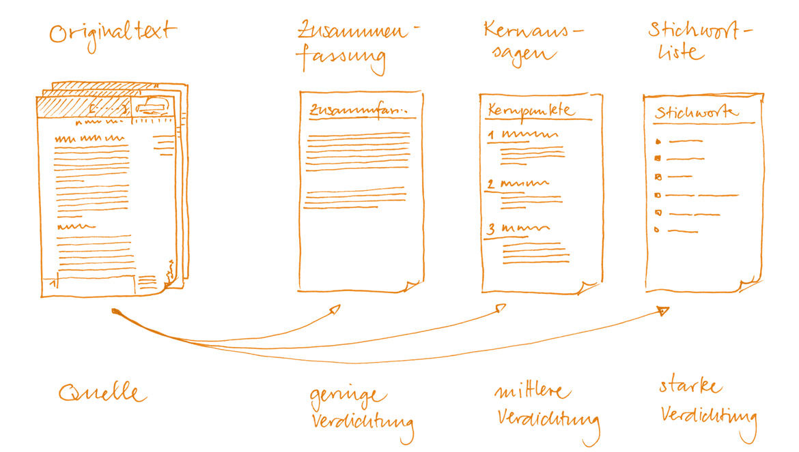

# Zusammenfassen

**Fach:** Deutsch
**Typ:** Baustein für den eigenständigen Kompetenzaufbau

Von der Zusammenfassung über Kernaussagen bis zur Stichwortliste.

## Ausgangslage

Bei der heutigen Informationsflut ist es enorm wichtig, im Schreiben und Verwenden von Zusammenfassungen geübt zu sein. Gut zusammenfassen zu können, zählt beim Lernen zu den zentralen Kernkompetenzen.

*Link zur Materialkiste (siehe Original-PDF)*

## Worum geht es?

Zusammenfassungen helfen beim Lernen - das Schreiben einer Zusammenfassung ist bereits ein wichtiger Lernprozess: Durch die Reduktion auf das Wesentliche eines Textes geschieht ein Selektionsprozess, der im Gehirn gewisse Aussagen des Textes mit der Etikette WICHTIG versieht. Durch das Neuformulieren in eigenen Worten wird der Lerngegenstand persönlich - das heisst auf eine individuelle Art mit dem Vorwissen verknüpft und im Gedächtnis abgespeichert.

Häufig wird Zusammenfassen mit "jeden zweiten Satz abschreiben" verwechselt. Völlig falsch! Nur wenn du eigene Formulierungen findest, hast du den Text wirklich verstanden und ziehst einen Gewinn daraus. Bei der Auswahl der wichtigen Informationen helfen dir die Unterstreichungen und Randnotizen, die du bereits beim Lesen gemacht hast (siehe Baustein Informierendes Lesen).

## Formen

Abhängig von der Ausführlichkeit der Zusammenfassung unterscheidet man drei Formen: die Zusammenfassung (Textform, relativ umfangreich), Kernaussagen (Stichwort und elliptische Kurzsätze, mittlerer Umfang) und Stichwörter (Einzelbegriffe, sehr knapper Umfang).

## Schritte

### Fliesstext

Zusammenfassungen als Fliesstext werden in knappen, aber ganzen Sätzen geschrieben und sorgfältig formuliert. Als Faustregel gilt: Wenn man die Zusammenfassung nur versteht, wenn man auch den dazugehörigen Volltext gelesen hat, ist sie ungenügend.

### Kernaussagen

Die Kernaussagen-Methode ist ein idealer Kompromiss zwischen der recht aufwendigen Zusammenfassung und der Stichwortliste, welche in vielen Fällen zu knapp und daher später unbrauchbar ist. Die Kernaussagen-Methode holt aus beiden anderen Techniken je die Vorteile heraus, ohne deren Nachteile zu haben. Jeder Kernpunkt wird mit einem treffenden Stichwort kurz und bündig charakterisiert - damit ist mit einem Wort schon sehr viel gesagt. Die Wahl von passenden Stichworten ist daher ein wichtiger Prozess. Um auch später noch etwas mit den Stichworten anfangen zu können, werden diese nun mit elliptischen (das heisst nicht vollständigen) Sätzen ergänzt. Das Stichwort erhält so noch etwas "Fleisch an den Knochen" und gibt später beim Lernen mehr her - insbesondere, wenn zwischen dem Erstellen der Kernaussagen und dem Lernprozess eine längere Zeit liegt (zum Beispiel beim Lernen für eine Jahresschlussrepetition).

### Stichworte

Im Prinzip ist die Stichworttechnik identisch mit der Kernaussagen-Methode, ausser dass hier auf die Ergänzungen in Satzform verzichtet wird. Stichwortlisten sind sehr knapp und daher vor allem für relativ einfache Texte oder Lernabschnitte zu empfehlen. Da das Repetieren eines Themas nur mit Hilfe von Stichwortlisten eine grosse assoziative Leistung abverlangt, kann diese Methode auch als weiterer Lernschritt nach einer normalen Zusammenfassung in Textform verwendet werden. Bei der Prüfung reicht es dann, an ein Stichwort zu denken, und alle weiteren Erklärungen dazu tauchen automatisch vor dem inneren Auge auf, da sie bereits sehr gut verankert (assoziiert) sind.

---

**Konzept & Gestaltung:** David Halser | denkwerk.schule
**Lizenz:** CC-BY-SA
